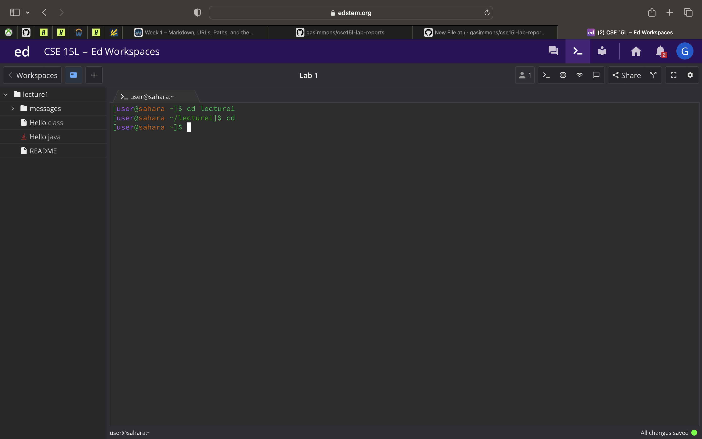
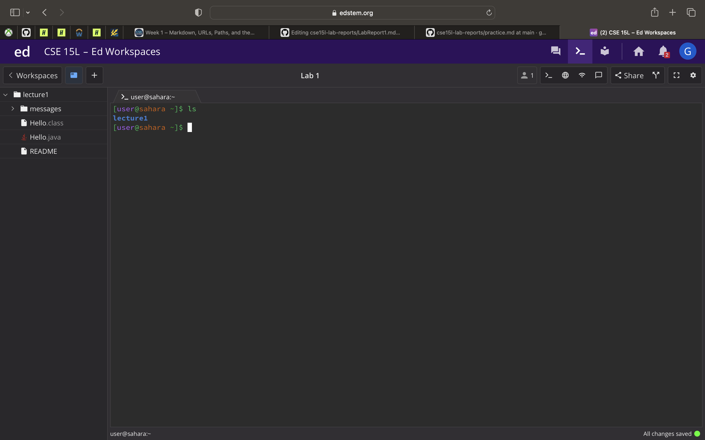

# Lab Report 1 - Remote Access and File Systems
---
Using the commands cd, ls, and cat with different arguements to see the results

**No Arguments**
---

cd with no arguments:

 
I ran the command cd with no arguments in both the lecture1 directory(as seen in the picture) and in the home directory. When ran in lecture1, I was returned back to the home directory, and when ran in the home directory nothing happened. This is because cd stands for change directory, and without parameters is meant to return the user to the home directory. The results were expected, and was not an error. 

ls with no arguments:

I ran the ls command with no arguments in the home directory. When ran in the home directory, the output was lecture1, because ls, which means list, lists all of the files or directories within whatever parameter is given. When not given an argument like in this example, it will list all of the directories or files in the working directory, in this case the home directory. These results were expected and functioned as they were intended, meaning it was not an error.

cat with no arguments:

I ran the cat command with no arguments in the home directory. When ran from the home directory, the shell freezes, and you have to kill the process in order to be able to use it again. This is because the cat command, short for concatenate, is meant to print out file contents, and since there were no files given to the command, it got stuck waiting for an input, and was never able to finish the process, causing it to freeze. This is an error, the user is supposed to use cat command on a file, not on a directory, and since it causes the shell to freeze.

**Using the command with a path to a directory as argument**
---

cd with a path to a directory as the argument:

I ran the cd command with a path to a directory as the argument from the home directory. When ran, as expected by the name "change directory", the directory called became the new working directory. In this case the working directory became what was given as an argument, the lecture1 directory. There was no actual output besides the changing of the working directory, but this was expected. Since the directory was changed as expected, there was no error.

ls with a path to a directory as the argument:

I ran the ls command with a path to a directory as the argument from the home directory. When called, all of the contents of the directory that was called as the argument were output. All of the files were output in one color, while the folder was in another in order to differentiate them within the list. This was the expected output, and as such, is not an error.  

cat with a path to a directory as the argument:

I ran the cat command with a path to a directory as the argument from the home directory. When called, the output is a message saying that the directory given in the argument, is a directory, which is true. Cat, which is used to concatenate, cannot be used on a directory as the directory is not a text file. This means that the output is an error message, as the command is meant to be used on a file containing text. 

**Using the command with a path to a file as the argument**
---

cd with a path to a file as the argument:

I ran the cd command with a path to a file as the argument from the home directory. When called, the output is a message saying that the file that the input path leads to, is not a directory. The error message output makes sense because cd stands for change directory, so it should not be expected to be able to change to a file, causing the error.

ls with a path to a file as the argument:

I ran the ls command with a path to a file as the argument from the home directory. When called, the output is just the name of the file that the input path led to. ls is usually used on a directories as it is used to list out the contents of a directory, so when used on a file, which does not contain any files within, it only gives the name of the file. This is not necessarily an error, but it is also not very helpful, and the command should mainly be used on a directories. 

cat with a path to a file as the argument:

I ran the cat command with a path to a file as the argument from the home directory. When called, the output is the text that make up the file. Multiple paths can be called, which outputs the contents of each of the files called, as shown in the last example. The contents of each of the files were printed out, as expected to be done by the concatenate command. This is not an error, as what is expected to be output, is output. 

