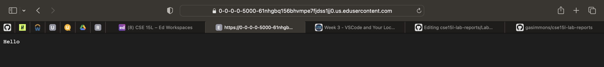
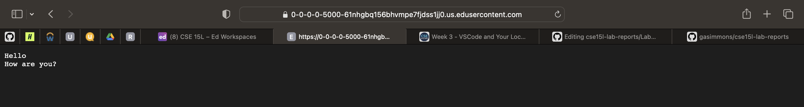
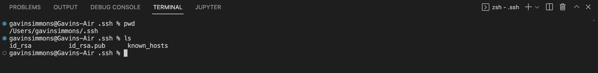
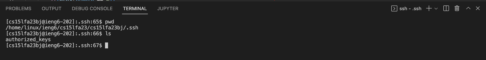
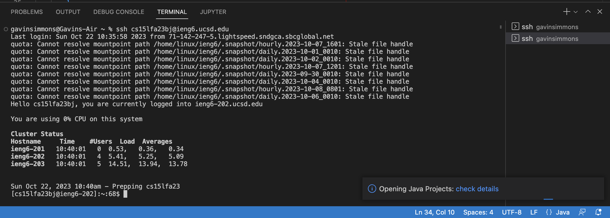

# Lab Report 2 - Servers and SSH Keys

**Part 1**
Code for the String Server implementation:

First Instance of /add-message:

This instance of /add-message calls the method handleRequest with the URL as the given argument. In handle request, it checks to see if the path reads "add-message", which it does, then it checks the query to see if it is "s =". The variable newMessage is set to "Hello", and is then added to messages, which is orginally an empty array list. Finally, handleRequest finishes by returning each of the elements of messages, separated by a new line character, which in this case is just one line with the string Hello.

Second Instance of /add-message:

This instance of /add-message also calls the method handleRequest with the URL as the given argument. In handleRequest, it checks again to see if the path reads "add-message", which it does, then it checks to the query to see if it is "s=". The variable newMessage is set to "How are you?", which is the given in the URL following "s=". newMessage is then added to messages, the same array list as the first instance, but this time that array list already contains the string "Hello". Finally, handleRequest returns each of the elements of messages, separated by a new line character, which in this case is two lines, the first reading "Hello" from the first isntance of /add-message, and the second reading "How are you?" from the second instance.

**Part 2**

Path to Private Key:

The private key is id_rsa, while the public key is id_rsa.pub. This means the path to the Private key is /Users/gavinsimmons/.ssh/id_rsa.

Path to Public Key:

IENG6 Login Without a Password:

**Part 3**

This week I learned a lot about http requests alongside starting both a local and remote server. I had known about remote access to computers, like with the UCSD super computer, but this was the first time I had learned the ssh command used to access these computers. Also the basic understanding of URLs to be able to use commands like /add-message, or /increment were brand new to me, and interesting to see work.
