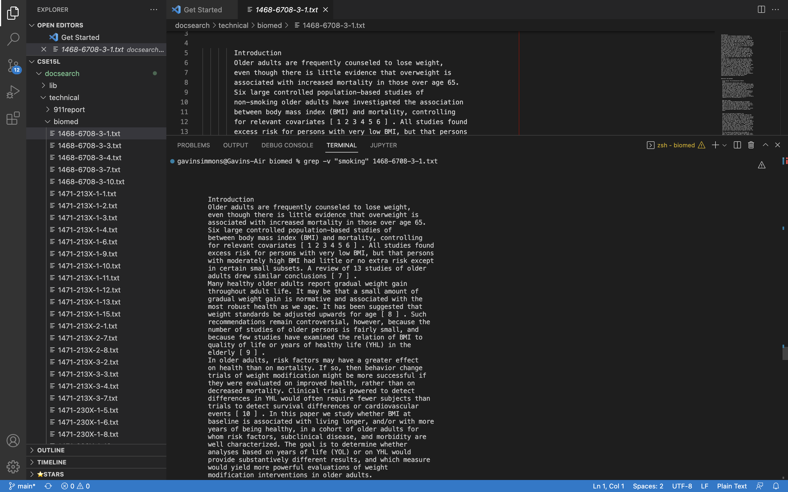
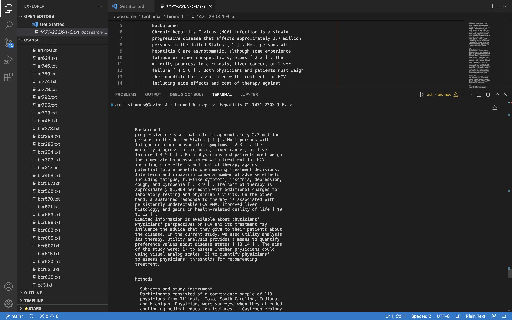
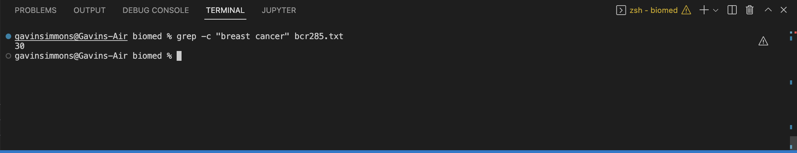
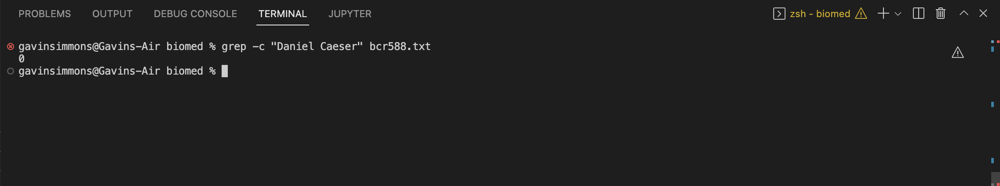
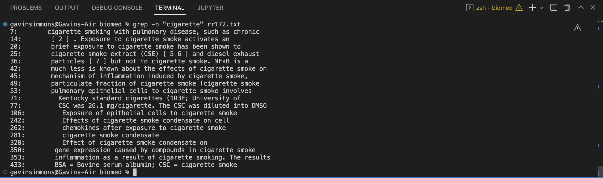
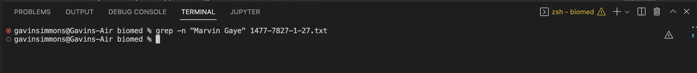
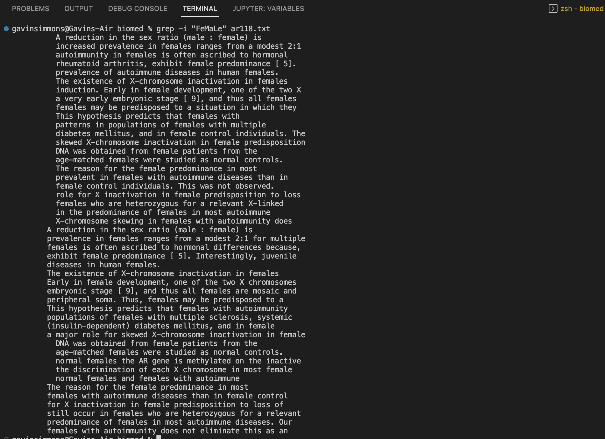
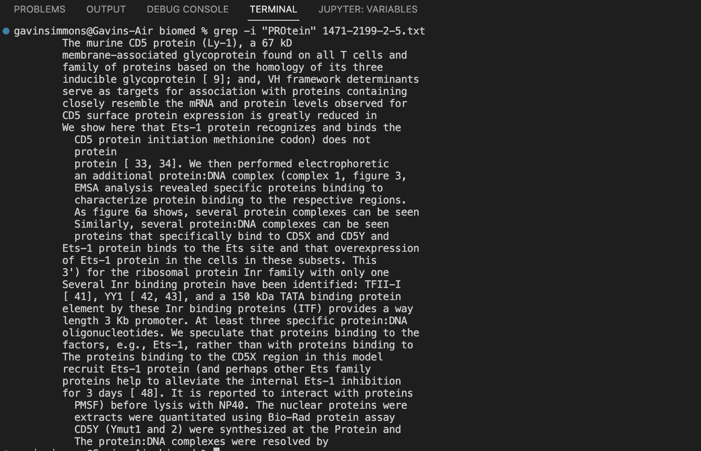

**Lab Report 3**

Part 1 Bugs: 

Part 2 Researching Grep Commands: 

1. grep -v

Grep -v is an invert matcher, meaning that it searches and displays the lines that do not contain the pattern input into the command. In this example it is displaying all of the lines that do not contain the word "smoking". This could be useful for finding lines that do not contain a certain keyword, or even for removing in line comments in code by searching for "//".

Grep -v, the invert matcher, searches and displays all the lines that do nto contain the pattern from the command. In this example, it displays all the lines that do not contain the phrase "hepatitis C", showing that it works for phrases, and is case sensitive. This could be useful paired with the recursive -r command, so that you could display all the files that do not contain a certain pattern. 

2. grep -c

Grep -c is a command that only returns the number of lines that the pattern is present in. In this example, it returns the number of lines that the phrase "breast cancer" is present in. This could be useful for figuring out whether a file has relevant information or not searching for a keyword and checking the number of lines it is present. 

Grep -c counts the number of lines that the pattern is present. In this example, it returns 0 because the pattern "Daniel Caeser" is not present in any of the lines. This command could also be used along with other commands, for example -v, in which it would count all the lines that do not contain a phrase, which is useful for determining the relevance of the information within a file. 

3. grep -n

Grep -n acts just like grep except it also prints out the line number at which each line with the pattern. In this example, the line and the line number is displayed for every line that has the word "cigarette". This could be useful when searching for any keyword within a file, so that you can go into the file and edit at each of those points.

Grep -n displays all the lines that contain the pattern, while also including the line number associated with those lines. In this example, nothing is returned because "Marvin Gaye" is not present in the file. This tool would be especially useful when dealing with large data files, so that you can easily find something of interest, and be able to go in a validate it.

4. grep -i 

Grep -i acts just like the regular grep command, but it ignores capitalization. In this example, it displays the lines that contain the word "female" regardless of capitalization. This can be useful for finding keywords regardless of if they are capitalized or not.

Grep -i displays all the lines that contain the pattern, regardless of capitalization. In this example, it returns all the lines that contain the word "protein" whether capitalized or not. This could be useful as it provides a more comprehensive list of lines, that will not miss out on any instances due to capitalization.
Source: 
[Man7.org](https://man7.org/linux/man-pages/man1/grep.1.html)

